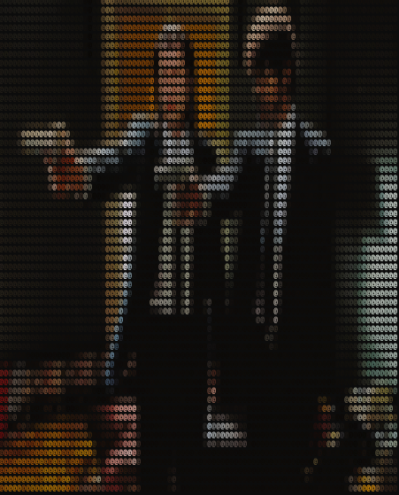
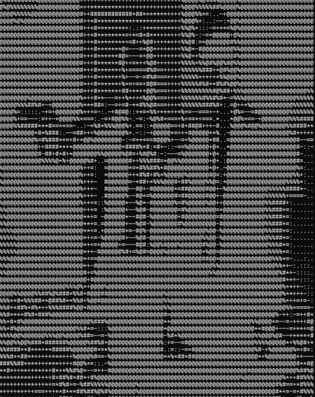

# Matrix Media Player


Matrix Media Player is command line tool that converts videos and images to ascii art in the command line.
It can record the output and write to a video file.

# Building
####The project requires OpenCV 3.0 or later.

### Visual Studio 
Install OpenCV in Visual Studio using your method of choice. [(I recommend vcpkg)](https://github.com/microsoft/vcpkg)
Clone this repository and open it in Visual Studio.

### CMake 
Install OpenCV with your Linux package manager as well as the following dependencies: VTK, Glew, Hdf5.

Example on Arch Linux using Pacman: 
```
pacman -S opencv vtk hdf5 glew
```

Run CMake to generate Makefile:
```
CMake CMakeLists.txt
```
Then run make: 
```
make
```
You'll be left with the executable named 'matrix_media_player.exe' on Windows or 'matrix_media_player' on Linux.


## Usage

For the moment, video recording is not available on Linux. But it works fine on Windows.
```
Usage: matrix_media_player [Options..] (File)
Options:
         --no-color  : Prints without color
         --no-pixels : Prints everything with the same character (@)
         --no-resize : Doesn't resize the frames to fit the console
         --rand      : Print with random characters
         --file (file path) : Input file path, image or video
```
Resize the command window so that the picture fits perfectly, when the recording starts do not move the window and keep it focused until the recording stops.
If you encounter problems while creating the video file, try running the program with admin privileges.

# Examples
### Video Default                          //    Video --no-pixels
  

# Images

### Default

### --no-pixels

### --no-color



