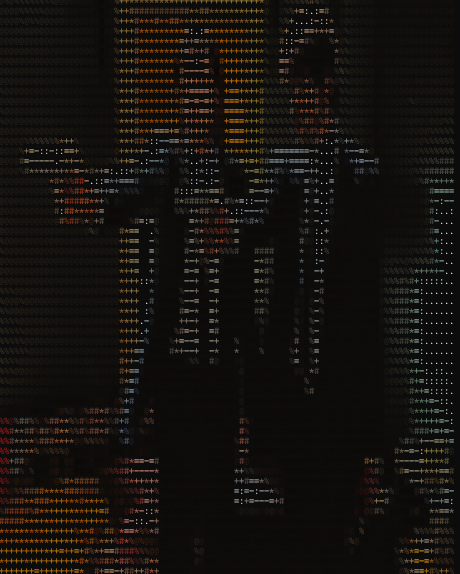

# Matrix Media Player


Matrix Media Player is command line tool that converts videos and images to ascii art in the command line.
It can record the output and write to a video file.

## Building

The project requires OpenCV 3.0 or later.
Install OpenCV in Visual Studio using your method of choice. [(See vcpkg)](https://github.com/microsoft/vcpkg)

Clone this repository and open it in Visual Studio.

## Usage

At the moment the program only works on Windows. Maybe someone will port it to linux?
Windows versions prior to Windows 10 need a console that supports ANSI to use colors (i recommend [ConEmu](https://github.com/Maximus5/ConEmu)).

```
Usage: mxvp [Options..] (File)
Options:
         --no-color  : Prints without color
         --no-pixels : Prints everything with the same character (@)
         --no-resize : Doesn't resize the frames to fit the console
         --file (file path) : Input file path, image or video
```

# Examples
### Video Default                     ### Video --no-pixels
  

# Images

### Default

### --no-pixels

### --no-color


